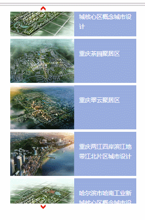

# js无缝滚动SeamlessScrolling1

效果如下：


all code:
```
<!doctype html>
<html lang="en">
<head>
    <meta charset="UTF-8">
    <title>JS控制图片上下无缝滚动特效代码</title>
    <link rel="stylesheet" href="css/lanrenzhijia.css"/>
</head>
<body>
<div class="span230" style="margin:0 auto;">
    <div id="leftDir" class="btntop">&nbsp;</div>
    <div id="scrollbox">
        <div class="scrollcon">
            <div id="boximg" class="scrollpic">
                <ul>
                    <li>
                        <a href="javascript:void(0)">
                            
                            <br />
                        哈尔滨市哈南工业新城核心区概念城市设计
                        </a>
                    </li>
                    <li>
                        <a href="javascript:void(0)">
                            
                            <br />
                        重庆茶园聚居区
                        </a>
                    </li>
                    <li>
                        <a href="javascript:void(0)">
                            
                            <br />
                        重庆翠云聚居区
                        </a>
                    </li>
                    <li>
                        <a href="javascript:void(0)">
                            
                            <br />
                        重庆两江四岸滨江地带江北片区城市设计
                        </a>
                    </li>
                </ul>
            </div>
            <div id="fuzhi" class="scrollpic">&nbsp;</div>
        </div>
    </div>
    <div id="rightDir" class="btnbottom">&nbsp;</div>
</div>
</body>
</html>
<script>
    var speed = 18;
    var direction="top";
    var tab = document.getElementById("scrollbox");
    var tab1 = document.getElementById("boximg");
    var tab2 = document.getElementById("fuzhi");
    var leftDir = document.getElementById("leftDir");
    var rightDir = document.getElementById("rightDir");
    tab2.innerHTML = tab1.innerHTML;
    function marquee(){
        switch(direction){
            case "top":
                if(tab2.offsetHeight - tab.scrollTop <= 0){
                    tab.scrollTop -= tab1.offsetHeight;
                }
                else{
                    tab.scrollTop++;
                }
                break;
            case "bottom":
                if(tab.scrollTop <= 0){
                    tab.scrollTop += tab2.offsetHeight;
                }
                else{
                    tab.scrollTop--;
                }
                break;
        }
    }
    function changeDirection(dir){
        direction = dir;
    }
    var timer = setInterval(marquee,speed);
    tab.onmouseover = function(){clearInterval(timer);};
    tab.onmouseout = function(){timer = setInterval(marquee,speed);};
    leftDir.onclick = function(){changeDirection("top");};
    rightDir.onclick = function(){changeDirection("bottom");};
</script>
```

